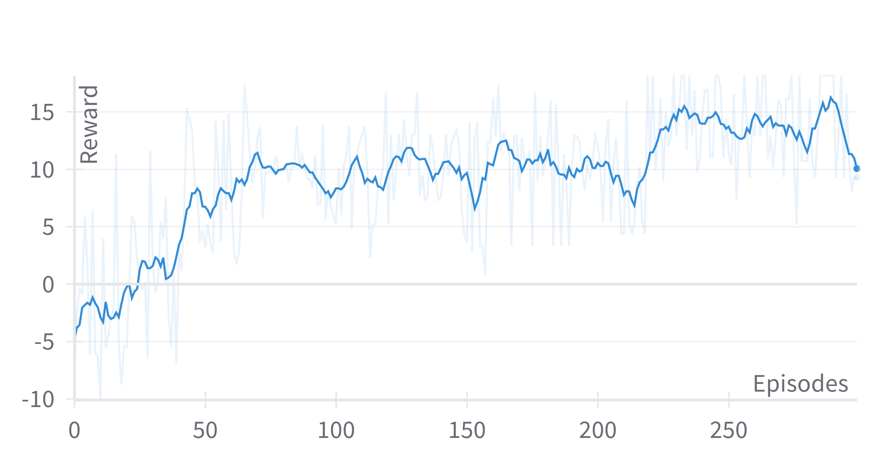
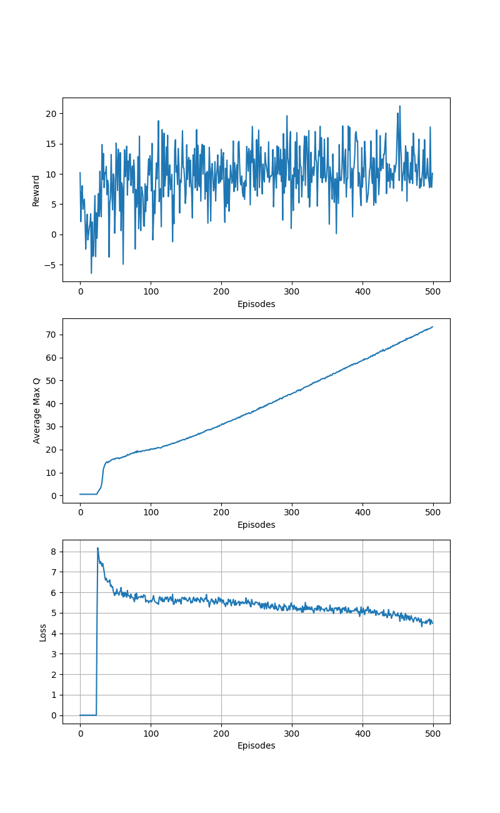
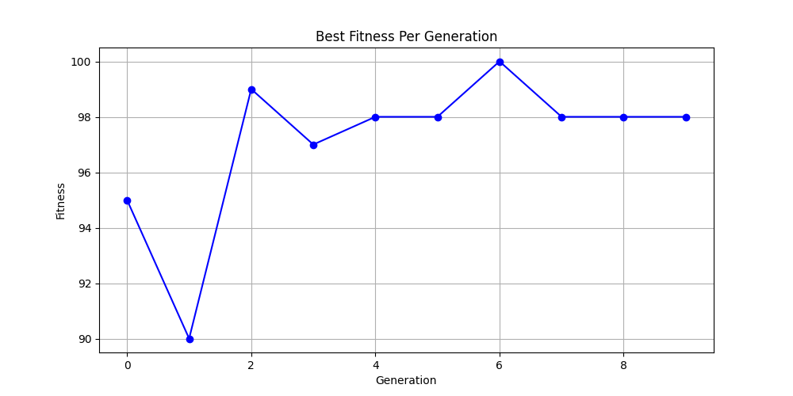
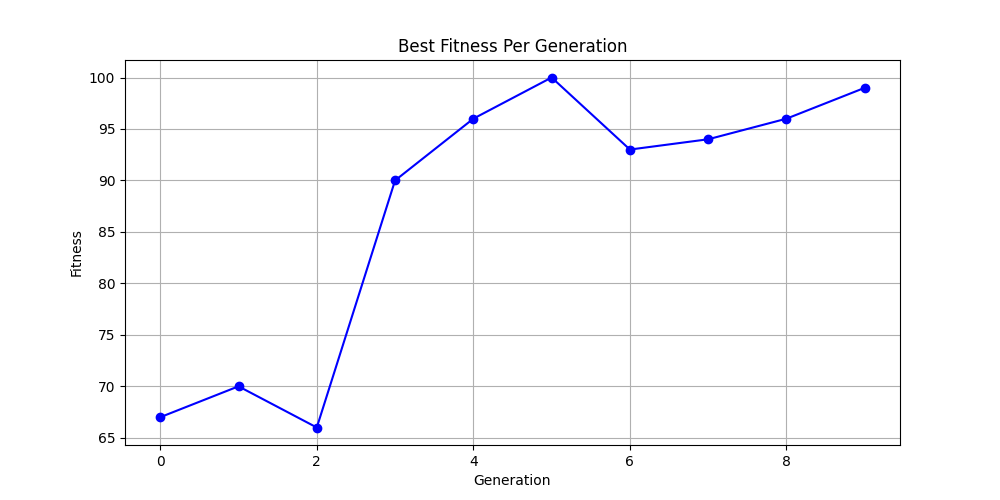

# Mancala-AI
Mancala[^1] is a classic board game where two players compete in stone collection. After beating the Nintendo Switch AI, I decided to write my own. The repository contains the complete game (e.g., capture logic) along with several AI players.
 
## Players
1. **Deep Q-Learning Network (DQN)**[^2]: Uses reinforcement learning to develop a strategy based on rewards.
2. **Double DQN**[^3]: Enhances DQN by reducing overestimation.
1. **Genetic Algorithm**[^4]: Evolution selects the fittest candidate after multiple generations of simulated games.
1. **Tournament Selection**[^5]: Selects the fittest candidate through multiple tournaments (i.e., battle royal).
1. **Minimax**[^6]: Simulates the game down to a specified depth before selecting a move.
1. **Greedy**: Focuses on immediate gains.
1. **Naive**: Moves randomly.
1. **Human**: You play the game.
 
## Usage
    python main.py
    
The main script:
1. Initializes and trains the AI agents.
2. Runs a tournament between them.
3. Allows the player to compete against the AI.
 
## Parameters
To facilitate experimentation, the non-trivial opponents are highly configurable.
 
#### DQN
1. **opponents** (list of player objects): The sparring buddies used by DQN during training.
1. **episodes** (int): Number of training games.
1. **epsilon_min** (float): Minimum epsilon for the epsilon-greedy policy.
1. **epsilon_decay** (float): Decay rate of epsilon.
1. **batch_size** (int): Size of the minibatch for training.
1. **capacity** (int): Capacity of the replay memory.
1. **gamma** (float): Discount factor for future rewards.
1. **learning_rate** (float): Learning rate for the optimizer.
1. **neurons** (int): Number of neurons in each hidden layer of the neural network.
1. **tau** (float): Soft update parameter for updating the target network.
2. **double_dqn** (boolean): Enables Double DQN.
 
#### Genetic Algorithm
1. **generations** (int): Number of iterations the algorithm will run.
1. **population_size** (int): Number of individuals in the population.
1. **mutation_rate** (float): Probability of mutation occurring in an individual.
1. **simulations** (int): Number of games each individual plays to evaluate fitness.
1. **elitism** (int): Number of top individuals directly carried over to the next generation.
1. **tournament** (int): Size of the tournament selection pool (0 for random selection).
1. **top** (int): Number of best individuals used for selection and breeding.
 
#### Minimax
1. **depth** (int): The maximum depth of the game tree that the algorithm will explore.
 
## A deeper dive for the nerds
 
#### Project Goal
My goal is to develop challenging opponents using different AI methods. This project has been immensely fun, and I may add more agents in the future.
 
#### Agent Evaluation

**Bug Alert**
I noticed a bug on the capture mechanism. The bug is fixed but I did not re-run the experiments yet.

Impartial evaluation is challenging due to varying performance metrics among agents, and using myself as a sparring partner isn't ideal. Thus, I opted for tournaments between agents as the most practical and fair method (i.e., the best agent has the most wins). *main.py* runs 100 games per agent combination, and an agent wins by beating >50% of the games. The table below demonstrates the performance of various agents in a tournament. Running the code with the provided parameters must deliver the same results. These configurations are <ins>not</ins> optimal for training parameters but serve as a good starting point. Feel free to experiment and let me know of any interesting findings.
<table align="center">
  <tr>
    <th>Player</th>
    <th>Player 1 Wins</th>
    <th>Player 2 Wins</th>
    <th>Total Wins</th>
  </tr>
  <tr>
    <td>Minimax</td>
    <td align="center">6</td>
    <td align="center">6</td>
    <td align="center">12</td>
  </tr>
  <tr>
    <td>Double DQN</td>
    <td align="center">5</td>
    <td align="center">4</td>
    <td align="center">9</td>
  </tr>
  <tr>
    <td>DQN</td>
    <td align="center">2</td>
    <td align="center">3</td>
    <td align="center">5</td>
  </tr>
  <tr>
    <td>Vanilla GA</td>
    <td align="center">3</td>
    <td align="center">2</td>
    <td align="center">5</td>
  </tr>
  <tr>
    <td>Greedy</td>
    <td align="center">2</td>
    <td align="center">3</td>
    <td align="center">5</td>
  </tr>
  <tr>
    <td>Tournament GA</td>
    <td align="center">1</td>
    <td align="center">1</td>
    <td align="center">2</td>
  </tr>
  <tr>
    <td>Naive</td>
    <td align="center">0</td>
    <td align="center">0</td>
    <td align="center">0</td>
  </tr>
</table>
Minimax, which simulates the game two moves deep, dominated every game. Double DQN lost only three games (two against Minimax) and outperformed DQN, Vanilla GA, and Greedy, which all tied for third place. Tournament GA underperformed, likely due to overfitting (i.e., individuals only learned how to beat their peers). Unsurprisingly, Naive lost every game and serves as a good baseline.

A noteworthy observation is that most agents execute a perfect opening[^7] as Player 1. Furthermore, I experimented with training the Genetic and DQN agents both as Player 1 and Player 2 but found no significant benefit. This can be attributed to the minimal impact of player order on the overall state space. Considering the configuration of 48 stones distributed across 14 pits, the total number of possible states is approximately:
$$\binom{48 + 14 - 1}{14 - 1} = \binom{61}{13}$$
 
#### DQN
DQN training involves numerous parameters and is notoriously unstable. In addition, designing a dense and effective reward policy is more of an art than a science. However, the use of Huber loss and soft updates of network weights (Polyak averaging) is beneficial in stabilizing training. Both DQN agents were trained against Minimax (i.e., the strongest agent) but there is potential for improvement if trained against a diverse set of strategies. 

The figure below illustrates the reward and loss averages per episode, as well as the average Q-value for preselected states, comparing Double DQN (left) and DQN (right). Interestingly, despite the similar figures, Double DQN outperforms DQN in playing Mancala. This highlights the difference between evaluation metrics and real-world performance, which is especially true for reinforcement learning.

 

 
#### Genetic Algorithm
I often heard in academic circles that *"genetic stuff never works"*. Nevertheless, I decided to give this *underdog* a chance. Both vanilla and tournament selection use the number of wins as fitness to evolve a score distribution for the pits. When the agent acts, the score is multiplied by the number of stones, and the pit with the highest value is selected as the next move. The figure below shows the best fitness per generation for Vanilla GA (left) and Tournament GA (right).

 
#### Minimax
Given proper evaluation, deep explorations can outperform any player. However, the number of possible states grows exponentially, making Minimax slow even with alpha-beta pruning[^8]. An interesting observation is that even depths perform better than odd depths. Intuitively, even depths end on the opponent's turn, allowing a safer strategy, assuming optimal play. On the other hand, odd depths are riskier since the player does not see the opponent's immediate response.

#### Future Work
I plan to add more reinforcement learning agents and, data provided, supervised learning agents.
 
## References
[^1]: Mancala: https://en.wikipedia.org/wiki/Mancala
[^2]: DQN paper: https://arxiv.org/pdf/1312.5602
[^3]: Double DQN paper: https://arxiv.org/pdf/1509.06461v3
[^4]: Genetic Algortithm: https://en.wikipedia.org/wiki/Genetic_algorithm
[^5]: Tournament Selection: https://en.wikipedia.org/wiki/Tournament_selection#:~:text=Tournament%20selection%20is%20a%20method,at%20random%20from%20the%20population.
[^6]: Minimax Algorithm: https://en.wikipedia.org/wiki/Minimax#:~:text=Minmax%20(sometimes%20Minimax%2C%20MM%20or,case%20(maximum%20loss)%20scenario.
[^7]: Solving Kalah paper: https://naml.us/paper/irving2000_kalah.pdf
[^8]: Alpha-beta pruning: https://en.wikipedia.org/wiki/Alpha%E2%80%93beta_pruning
